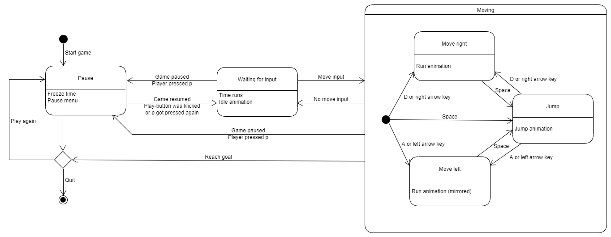

# mArIo
Game with genetic algorithm bots

[Play the game!](https://thetex.itch.io/mario?secret=0Od8ESv4kBi3M2Cxzmc75uvJrA)

## 1. UML  
[can be found here](https://github.com/JHoster/mArIo/tree/main/Exercises/UML)  

Activity diagram of the game, created with [UMLetino](http://www.umletino.com/):  
  
State diagram of the controls, created with [UMLetino](http://www.umletino.com/):    
  
Class diagram, created with Visual Studio 2015:  
  
<!---
Genetic algorithm / Population manager:  
  
Bot decision making:  

-->
## 2. DDD  
[The strategic design, ](https://github.com/JHoster/mArIo/blob/main/Exercises/DDDStrategicDesign.svg) created with [draw.io](https://app.diagrams.net/)  
  

<!--
The strategic design is shown in the game overview: https://github.com/JHoster/mArIo/blob/main/Stuff/mArIoOverview.svg  
  -->
Code:  
[Player](https://github.com/JHoster/mArIo/blob/main/Assets/Player.cs)  
[Brain of bots](https://github.com/JHoster/mArIo/blob/main/Assets/Brain.cs)  
[Population Manager](https://github.com/JHoster/mArIo/blob/main/Assets/PopulationManager.cs)  
[Camera](https://github.com/JHoster/mArIo/blob/main/Assets/Cam.cs)  
[Obstacles](https://github.com/JHoster/mArIo/blob/main/Assets/Obstacles.cs)  
[Menu](https://github.com/JHoster/mArIo/blob/main/Assets/Menu.cs)  
[Leaderboard]() - Not implemented (yet)  

## 3 Metrics  
[Metric created with Visual Studio 2019](https://github.com/JHoster/mArIo/blob/main/Exercises/VSMetric.png):
  

## 4 CCD  

## 5 Build Management  

## 6 Unit-Tests  

## 7 Continous Delivery  

## 8. IDE
Nice Visual Studio shortcuts:  
Ctrl+D Duplicate line  
Ctrl+L Cut line  
Ctrl+K, Ctrl+C Comment line  
Ctrl+K, Ctrl+U Uncomment line  
Ctrl+K, Ctrl+D format document  
Alt + arrow-up Move line up  
Alt + arrow-down Move line down  

## 9 DSL  

## 10 Funcitonal Programming  

To do:
1. UML at least 3 good diagrams
2. DDD If your domain is too small, invent other domains around and document these domains (as if you have 5 Mio € from Edlich-Investment!) Develop a clear strategic design with mappings/relationships
3. Metrics at least two. Sonarcube would be great
4. Clean Code Development at least 5 points you can show me + 10 points your cheat sheet
5. Build Management with any Build System as Ant, Maven, Gradle, etc. (only travis is perhaps not enough) Do e.g. generate Docs, call tests, etc.
6. Integrate some nice Unit-Tests in your Code to be integrated into the Build
7. Continuous Delivery show me your pipeline in e.g. Jenkins, Travis-CI, Circle-CI, etc.
8. Use a good IDE and get fluent with it as e.g. IntelliJ. What are your favorite Key-Shortcuts?!
9. DSL Create a small DSL Demo example snippet in your code even if it does not contribute to your project
10. Functional Programming (prove that you have covered all functional aspects in your code as
- only final data structures
- (mostly) side effect free functions
- the use of higher-order functions
- functions as parameters and return values
- use closures / anonymous functions

## Fun
Working with machine learning algorithm always leads to funny stories.  
Here are some of them:  

### Why aren't they moving?  
In the first iteration some bots moved forward and jumped, but in the following iterations more and more of them would just stand there or jump on the spot, even though the fitness-function checked which bot travelled the most distance.
Turns out, the ones that moved forward fell in the pits and died.
Dead bots can't give their DNA to the next population!
So the bots that did nothing except jumping were the fittest, because at least they survived!

### Double Jump  
Bots did double jumps, even though I gave them the same controls as the player.
Was wondering for a while how they are doing it.
Turns out, the player could do it too, but I never tried!
Bots are great for playtesting!
