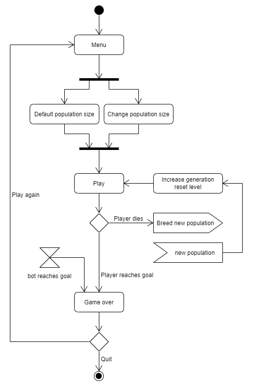
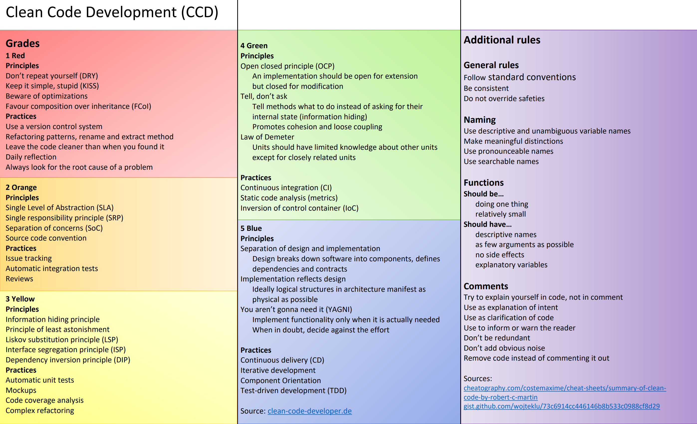

# mArIo
Game with genetic algorithm bots

[Play the game!](https://thetex.itch.io/mario?secret=0Od8ESv4kBi3M2Cxzmc75uvJrA)

Table of contents  
  * [1. UML](#1-uml)
  * [2. DDD](#2-ddd)
  * [3 Metrics](#3-metrics)
  * [4 CCD](#4-ccd)
  * [5 Build Management](#5-build-management)
  * [6 Unit-Tests](#6-unit-tests)
  * [7 Continous Delivery](#7-continous-delivery)
  * [8. IDE](#8-ide)
  * [9 DSL](#9-dsl)
  * [10 Funcitonal Programming](#10-funcitonal-programming)

## 1. UML  
[can be found here](https://github.com/JHoster/mArIo/tree/main/Exercises/UML)  

Activity diagram of the game, created with [UMLetino](http://www.umletino.com/):  
  
State diagram of the controls, created with [UMLetino](http://www.umletino.com/):    
  
Class diagram, created with Visual Studio 2015:  
  
<!---
Genetic algorithm / Population manager:  
  
Bot decision making:  

-->
## 2. DDD  
[The strategic design, ](https://github.com/JHoster/mArIo/blob/main/Exercises/DDDStrategicDesign.svg) created with [draw.io](https://app.diagrams.net/)  
  
  

<!--
The strategic design is shown in the game overview: https://github.com/JHoster/mArIo/blob/main/Stuff/mArIoOverview.svg  
  -->
Code:  
[Player](https://github.com/JHoster/mArIo/blob/main/Assets/Player.cs)  
[Brain of bots](https://github.com/JHoster/mArIo/blob/main/Assets/Brain.cs)  
[Population Manager](https://github.com/JHoster/mArIo/blob/main/Assets/PopulationManager.cs)  
[Camera](https://github.com/JHoster/mArIo/blob/main/Assets/Cam.cs)  
[Obstacles](https://github.com/JHoster/mArIo/blob/main/Assets/Obstacles.cs)  
[Menu](https://github.com/JHoster/mArIo/blob/main/Assets/Menu.cs)  
Leaderboard - Not implemented (yet)  

## 3 Metrics  
### [Metrics measured with Visual Studio 2019](https://docs.microsoft.com/en-us/visualstudio/code-quality/code-metrics-values?view=vs-2019)
  
#### Maintainability Index:
Value between 0 and 100 that represents the relative ease of maintaining the code. A high value means better maintainability.  
#### Cyclomatic Complexity:
Measures the structural complexity of the code, by calculating the number of different code paths in the flow of the program. A program that has complex control flow requires more tests to achieve good code coverage and is less maintainable.  
#### Depth of Inheritacne:
Indicates the number of different classes that inherit from one another, all the way back to the base class. The higher this number, the deeper the inheritance and the higher the potential for base class modifications to result in a breaking change. For Depth of Inheritance, a low value is good and a high value is bad.  
#### Class Coupling:
Measures the coupling to unique classes through parameters, local variables, return types, method calls, generic or template instantiations, base classes, interface implementations, fields defined on external types, and attribute decoration. Good software design dictates that types and methods should have high cohesion and low coupling.  
#### Lines of source code:
Indicates the exact number of source code lines that are present in your source file, including blank lines.  
#### Lines of executable code:
Indicates the approximate number of executable code lines or operations. This is a count of number of operations in executable code.  

### Metrics measured with SonarQube  
  

## 4 CCD  

In the [Player](https://github.com/JHoster/mArIo/blob/main/Assets/Player.cs)-script the following rules were apllied:  
KISS: Code is simple and understandable.  
Principle of least astonishment: Press P to pause the game, A & D to move and space to jump are common game conventions.  
Functions are relatively small and side effect free, have descriptive names and explanatory variables.  
Comments are used only if necessary to structure and clarify the code.  
YAGNI: All implemented functions are needed.  

[CCD Cheat Sheet](https://github.com/JHoster/mArIo/blob/main/Exercises/CCDCheatSheet.pdf)  
  

## 5 Build Management  
I used gradle to create a [simple java application](https://github.com/JHoster/mArIo/tree/main/Gradle).  
[Generate Player](https://github.com/JHoster/mArIo/blob/main/Gradle/app/src/main/java/mArIoBuild/app/Player.java)  
[Test Player](https://github.com/JHoster/mArIo/blob/main/Gradle/app/src/test/java/mArIoBuild/app/PlayerTest.java)  

## 6 Unit-Tests  
I used the Unity Test Runner and created some nice  
[Unit-Tests](https://github.com/JHoster/mArIo/blob/main/Assets/UnitTest/Tests/TestSuite.cs)  
  

## 7 Continous Delivery  
I used [GitHub Actions](https://github.com/JHoster/mArIo/actions) to  
[acquire an activation file of Unity](https://github.com/JHoster/mArIo/blob/main/.github/workflows/activation.yml) which I needed to  
[build my game](https://github.com/JHoster/mArIo/blob/main/.github/workflows/main.yml)  
In addition to automaticly build the game with every push to the repo, I can use the [butler](https://itch.io/docs/butler/) of itch.io (where people can download or play the game online), to upload the new build in order to achieve continuous deployment!  

## 8. IDE
Nice Visual Studio shortcuts:  
Ctrl+D Duplicate line  
Ctrl+L Cut line  
Ctrl+K, Ctrl+C Comment line  
Ctrl+K, Ctrl+U Uncomment line  
Ctrl+K, Ctrl+D format document  
Alt + arrow-up Move line up  
Alt + arrow-down Move line down  

## 9 DSL  
I created a simple DSL with eclipse:  
[Item model](https://github.com/JHoster/mArIo/blob/b430376e78b63eb05dcfdcc745e33eb5c6e596c0/mArIoDSL.mydsl/src/mArIoDSL/MyDsl.xtext)  
[Item test](https://github.com/JHoster/mArIo/blob/b430376e78b63eb05dcfdcc745e33eb5c6e596c0/testItem.mydsl)  
I don't use items in this game, but I could use this DSL to create Items with an unique ID, a name, an optional description and a given weight.  

## 10 Funcitonal Programming  

## To do  
1. UML at least 3 good diagrams
2. DDD If your domain is too small, invent other domains around and document these domains (as if you have 5 Mio € from Edlich-Investment!) Develop a clear strategic design with mappings/relationships
3. Metrics at least two. Sonarcube would be great
4. Clean Code Development at least 5 points you can show me + 10 points your cheat sheet
5. Build Management with any Build System as Ant, Maven, Gradle, etc. (only travis is perhaps not enough) Do e.g. generate Docs, call tests, etc.
6. Integrate some nice Unit-Tests in your Code to be integrated into the Build
7. Continuous Delivery show me your pipeline in e.g. Jenkins, Travis-CI, Circle-CI, etc.
8. Use a good IDE and get fluent with it as e.g. IntelliJ. What are your favorite Key-Shortcuts?!
9. DSL Create a small DSL Demo example snippet in your code even if it does not contribute to your project
10. Functional Programming (prove that you have covered all functional aspects in your code as
- only final data structures
- (mostly) side effect free functions
- the use of higher-order functions
- functions as parameters and return values
- use closures / anonymous functions

## Fun
Working with machine learning algorithm always leads to funny stories.  
Here are some of them:  

### Why aren't they moving?  
In the first iteration some bots moved forward and jumped, but in the following iterations more and more of them would just stand there or jump on the spot, even though the fitness-function checked which bot travelled the most distance.
Turns out, the ones that moved forward fell in the pits and died.
Dead bots can't give their DNA to the next population!
So the bots that did nothing except jumping were the fittest, because at least they survived!

### Double Jump  
Bots did double jumps, even though I gave them the same controls as the player.
Was wondering for a while how they are doing it.
Turns out, the player could do it too, but I never tried!
Bots are great for playtesting!
